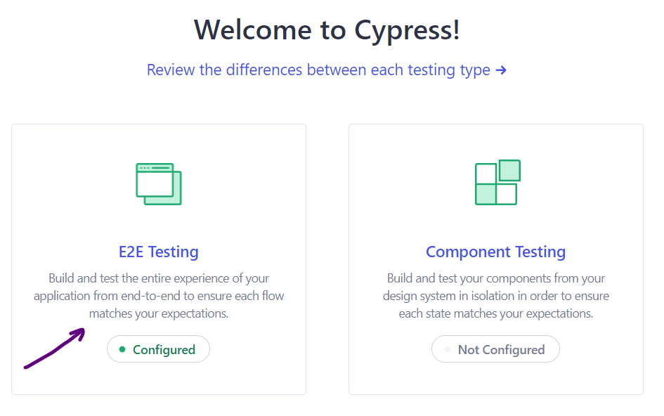
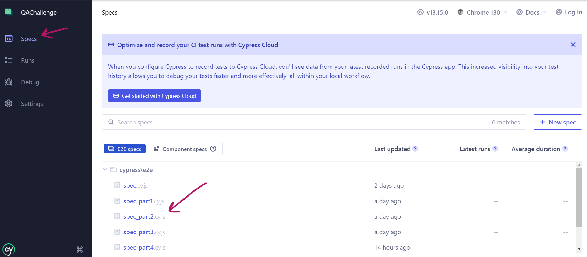
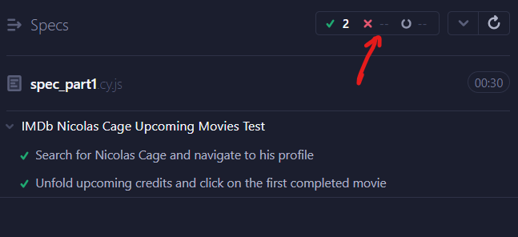
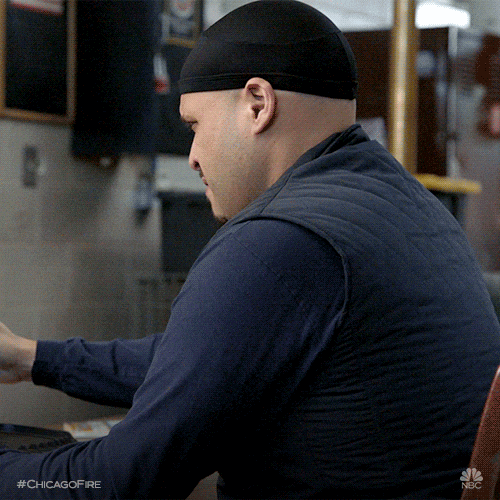

# QAChallengeForBrite

 QA Challenge for Brite Interview

 Tasks to perform to complete the challenge can be found in the accompanying pdf file (https://github.com/magdalenammcc/QAChallengeForBrite/blob/main/2024-junior-qa-engineer-challenge.pdf)

 ### Required tools: 

 - cypress (installation guide here: https://docs.cypress.io/app/get-started/install-cypress)
 - Chrome browser (https://www.google.com/intl/es_es/chrome/)
 - Firefox browser (https://www.mozilla.org/es-ES/firefox/new/)
 - cypress plug-ins: 
 
        * iframe (installation and use guidelines here: https://www.npmjs.com/package/cypress-iframe)
        * dayjs (installation and use in site: https://day.js.org/docs/en/installation/installation)

We'll be using Cypress in "E2E" configuration because we'll be testing the full app, not just individual components. 

### Step-by-step test execution: 

1) Download all files ending in *.cy.js 
2) Copy those files in your */cypress/e2e folder
3) Open your preferred terminal
4) Start running cypress: 

```npx cypress open ```

(note to future self: if you are running on Windows: never forget to first do ```fnm env --use-on-cd --shell powershell | Out-String | Invoke-Expression```)

5) Select "E2E Testing". Make sure it's configured, as the picture shows: 

<p align="center">

</p>

6) Select the test files in the following order: 

        - For the **first exercise** in the Challenge: 

                * [Part 1 (Nicolas Cage) - spec_part1.cy.js](https://github.com/magdalenammcc/QAChallengeForBrite/blob/main/spec_part1.cy.js)
                * [Part 2 (Top Box Office) - spec_part2.cy.js](https://github.com/magdalenammcc/QAChallengeForBrite/blob/main/spec_part2.cy.js)
                * [Part 3 (Breaking Bad) - spec_part3.cy.js](https://github.com/magdalenammcc/QAChallengeForBrite/blob/main/spec_part3.cy.js)
                * [Part 4 (Celebrities born yesterday) - spec_part4.cy.js](https://github.com/magdalenammcc/QAChallengeForBrite/blob/main/spec_part4.cy.js)
                * [Part 5 (Celebrities born yesterday but 40 years ago) - spec_part5.cy.js](https://github.com/magdalenammcc/QAChallengeForBrite/blob/main/spec_part5.cy.js)

        - For the **second exercise** in the Challenge:

                * [API test - APItest.cy.js](https://github.com/magdalenammcc/QAChallengeForBrite/blob/main/APITest.cy.js)

        - The rest of exercises can't be executed using ```cypress```; they can be found in the files as follows: 

                * third exercise : in file [Exercise3.md](https://github.com/magdalenammcc/QAChallengeForBrite/blob/main/Exercise3.md)
                * fourth exercise: in file [BugReport.md](https://github.com/magdalenammcc/QAChallengeForBrite/blob/main/BugReport.md)
                * fifth exercise: performed all over the other exercises


7) Download the specification files (with extensions ´´´*.cy.js´´´) for cypress, and move them to your ```*/cypress/e2e``` folder

8) Select the test you would like to use in browser that cypress is automating, as shown here: 

<p align="center">

</p>

9) And, finally, wait for the test to be completed. You will know the test is successful if you see this at the top left corner: 

<p align="center">

</p>

10) To run the tests for a different browser, such as Firefox, please go to terminal and execute this command: 

```
cypress run --browser firefox
```

(note: should this command not work, please substitute "firefox" for the complete path to the executable program file)

___

# But wait...

I can imagine your face looking like this: 

<p align="center">

</p>

Because the only really successful test from exercise 1 that I was able to complete was the one belonging to Part 1. 

Why? Because three tasks are blocking me:  

1- getting the full tree of variables to access the data that I wanted 
2- learning how to navigate iframes in cypress
3- correctly implementing cypress's plug-in ```dayjs``` to manipulate dates automatically in cypress

I am currently getting the necessary help to overcome these blocks. 

However, there is a piece of code that I will never forget because it helped me bypass execution errors from cypress, not the test itself,
following [these recommendations](https://github.com/cypress-io/cypress-example-recipes/tree/master/examples/fundamentals__errors)

```
Cypress.on('uncaught:exception', (err, runnable) => {
    // returning false here prevents Cypress from
    // failing the test, based on: https://github.com/cypress-io/cypress/issues/2554 
    return false
  })
  
  it('Shows "we are working on this" whenever cypress fails (not the website)', function () {
    cy.visit('https://www.spanishdict.com/examples/we%20are%20working%20on%20this?lang=en')
  })

``` 

___


## Final reflection

I appreciate the opportunity to complete this test, and I hope my approach reflects the qualities needed for the position. 
I have realised my need to revisit my html skills: several years of QA at backend (mainly javascript and query languages for databases)
have made my html proficiency become rusty, I must confess. 

I've done my best to apply careful attention to detail, logical thinking, transversal problem-solving, and consulting documentation and online tools 
(gitHub, StackOverFlow) to proceed with the termination of the tasks in the challenge.

I understand the importance of collaboration and communication in this role and look forward to contributing to a team where continuous 
improvement is valued. I'm excited about the possibility of bringing my skills to your organization and learning from the experience.

